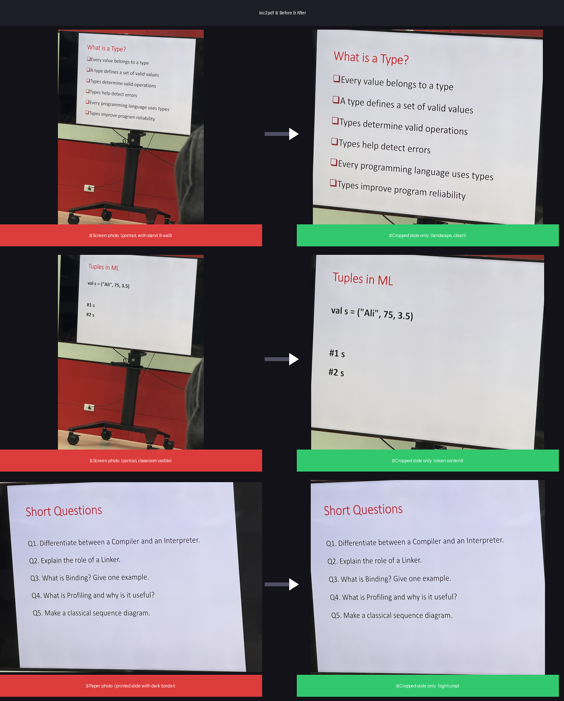

# 📄 lec2pdf — Lecture Slide Photos → Clean PDF

Convert a folder of iPhone lecture photos (HEIC, JPG, JPEG) into a single, clean, readable PDF — **one slide per page**, with background automatically cropped out.

> No manual cropping. No rotation headaches. Just point it at your photo folder and get a clean PDF.

---

## 📸 Before & After



> **Left** — raw photo taken in class (portrait, with stand, wall, and classroom background)
> **Right** — result after running `lec2pdf` (slide only, auto-rotated, clean crop)

---


## ✨ Features

| | What it does |
|---|---|
| 🔄 | **Auto-converts** HEIC (iPhone format) to JPEG — no manual conversion needed |
| 🔃 | **Auto-rotates** images based on EXIF orientation data |
| ✂️ | **Smart-crops** to just the slide content — removes classroom walls, stands, people |
| 🖥️ | Handles **projector/screen photos** (dark background, bright slide) |
| 📄 | Handles **printed paper slide photos** (paper fills the frame) |
| 📁 | Supports **HEIC, JPG, JPEG** — or mixed folders with all three |
| 📦 | **Auto-installs** Pillow + numpy on first run — no manual pip needed |

---

## 🖥️ Requirements

| Requirement | Notes |
|---|---|
| **macOS** | Required — uses built-in `sips` tool for HEIC conversion |
| **Python 3** | Already installed on macOS. Check with: `python3 --version` |
| **Pillow + numpy** | Auto-installed on first run. Or install manually (see below) |

> ⚠️ **This script is macOS only** because it uses the macOS built-in `sips` command for HEIC conversion. On Windows/Linux, convert HEIC photos to JPG first using any tool, then run the script on the JPG folder.

---

## 🚀 Quick Start (3 steps)

### Step 1 — Download the script

Click **Code → Download ZIP** on this GitHub page, unzip it, and place `slides_to_pdf.py` anywhere convenient (e.g. your Desktop or Documents folder).

Or with git:
```bash
git clone https://github.com/YOUR_USERNAME/lec2pdf.git
```

### Step 2 — Open Terminal

Press **Cmd + Space**, type `Terminal`, press Enter.

### Step 3 — Run it

```bash
python3 /path/to/slides_to_pdf.py  "/path/to/your/photo/folder"
```

The PDF is saved **inside your photo folder** automatically.

---

## 📖 Usage

```
python3 slides_to_pdf.py <PHOTO_FOLDER> [OUTPUT.pdf]
```

| Argument | Required | Description |
|---|---|---|
| `PHOTO_FOLDER` | ✅ Yes | Path to the folder containing your lecture photos |
| `OUTPUT.pdf` | ❌ Optional | Custom output filename. Defaults to `<folder_name>.pdf` inside the photo folder |

### Examples

**Basic — PDF saved inside the photo folder:**
```bash
python3 slides_to_pdf.py "~/Documents/lectures/week05/photos"
# → saves: ~/Documents/lectures/week05/photos/photos.pdf
```

**Custom output filename:**
```bash
python3 slides_to_pdf.py "~/Documents/lectures/week05/photos" week05_notes.pdf
# → saves: ~/Documents/lectures/week05/photos/week05_notes.pdf
```

**Photos on Desktop:**
```bash
python3 slides_to_pdf.py ~/Desktop/week07_photos
```

**Save PDF to a different location:**
```bash
python3 slides_to_pdf.py "~/Documents/lectures/week08/photos" "~/Desktop/week08.pdf"
```

**Weekly semester template (just change the number):**
```bash
WEEK=06
python3 slides_to_pdf.py "~/Documents/lectures/week${WEEK}/photos"
```

---

## 📦 Manual Installation (if auto-install fails)

```bash
pip3 install pillow numpy
```

Or with a virtual environment:
```bash
python3 -m venv venv
source venv/bin/activate
pip install -r requirements.txt
```

---

## 📸 Photo Tips for Best Results

- **Fill the frame** — try to capture mostly the slide, with minimal background
- **Hold steady** — avoid blur; blurry photos may not crop correctly
- **Good lighting** — avoid heavy shadows across the slide
- **Portrait or landscape** — both orientations work fine
- **Order matters** — photos are processed in alphabetical/filename order, so make sure they transfer in the correct sequence

---

## 🔍 How the Smart Crop Works

The script automatically detects which type of photo you have:

| Photo type | Detection method |
|---|---|
| **Printed paper** (slide fills the frame, bright image) | Finds dark borders and removes them |
| **Screen / projector** (slide on screen in classroom) | Finds the bright white slide rectangle against the dark background |

Both use brightness analysis on a downscaled version of the image for speed, then scale the crop back to full resolution.

---

## ❓ Troubleshooting

**`No supported photos found in: ...`**
→ Make sure the folder path is correct.
→ Use quotes around paths that contain spaces:
```bash
# ✅ Correct
python3 slides_to_pdf.py "~/Desktop/my lecture photos"

# ❌ Wrong
python3 slides_to_pdf.py ~/Desktop/my lecture photos
```

**`python3: command not found`**
→ Install Python 3 from [python.org](https://www.python.org/downloads/) or via Xcode tools:
```bash
xcode-select --install
```

**A slide is cropped incorrectly / shows blank**
→ The auto-detection struggled with that photo. This can happen with very dark, blurry, or heavily shadowed photos. Retake under better lighting for best results.

**Slides are in the wrong order in the PDF**
→ The script sorts by filename. Make sure your photos have names that sort correctly (e.g. `IMG_0001.HEIC`, `IMG_0002.HEIC`, ...).

---

## 📁 What Gets Uploaded to This Repo

```
lec2pdf/
├── slides_to_pdf.py    ← the script
├── requirements.txt    ← Python dependencies
├── .gitignore          ← prevents photos/PDFs from being committed
└── README.md           ← this file
```

> 🔒 The `.gitignore` is configured to **block all photo and PDF files** from being committed, so your lecture photos will never accidentally end up on GitHub.

---

## 🤝 Contributing

Found a bug or want to improve the crop detection? Pull requests are welcome!

1. Fork this repo
2. Create a branch: `git checkout -b my-improvement`
3. Make your changes and commit: `git commit -m "describe your change"`
4. Push and open a Pull Request

---

## 📜 License

MIT License — free to use, modify, and share.
